# Mundo Campero 

---

## Description

### What is Mundo Campero?

Mundo campero is an comprehensive web application for managing sheep herds,designed to simplify agricultural activities related to sheep breeding and management. This project was developed as part of **CS50’s Web Programming with Python and JavaScript** at Harvard, tackling a challenge beyond the examples provided in the course.

The sheep managment is a part of the beginning of something bigger which aims to integrate agriculture activities into single application.

### Why Choose This Topic?

1.	Distinctiveness: The topic is unique and goes beyond the common projects typically seen in the course.
2.	Challenge: It presents significant technical challenges, such as dynamic data fetching through custom local APIs and designing a modern, responsive user interface.
3.	Personal Connection: My family’s involvement in the agricultural sector inspired me to create a practical and impactful tool for this field. 

### Distinctiveness and Complexity

### Why Mundo campero is distinctive?

Mundo Campero is distinctive because it combines:
   * A non-traditional theme (sheep herd management) with real-world applicability.
   * A complex backend that includes local APIs for efficient and dynamic data communication between the frontend and backend.


### Why is Mundo Campero Complex?

The project involves:
 *	Designing and consuming custom APIs for CRUD operations on sheep and sales records.
 *	Implementing a dashboard with dynamic graphs and statistics for data visualization.
 *	Developing a robust authentication system with role-based access control.
 *	Combining frontend and backend technologies to deliver a seamless experience.
---

## Project structure
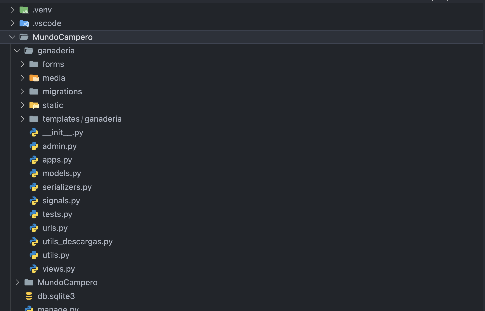
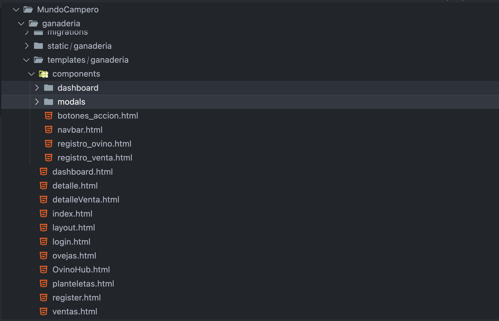

### Directory Overview

#### **Root-Level Files**
- **`utils.py`**: Contains utility functions used throughout the project to streamline operations or handle repetitive tasks.
- **`urls.py`**: Defines the URL routing for the application, mapping endpoints to their respective views.
- **`views.py`**: Houses the core logic for handling HTTP requests and responses.
- **`models.py`**: Defines the database models, outlining the structure of the application's data.
- **`admin.py`**: Configures how models are displayed and managed in the Django Admin interface.
- **`serializers.py`**: Converts complex data types (e.g., models) into JSON for API consumption and vice versa.
- **`signals.py`**: Manages Django signals for automating certain actions when specific events occur (e.g., saving a model).
- **`utils_descargas.py`**: Provides utility functions for handling file downloads and related operations.

---

#### **Template Structure**
- **`/templates/ganaderia/`**: Root folder for all HTML templates related to the "ganaderia" module.  
- **`/templates/ganaderia/components/`**: Contains reusable UI components to ensure modularity and reduce code repetition.
- **`/templates/ganaderia/components/modals/`**: Templates for modal dialogs used throughout the application.
- **`/templates/ganaderia/components/dashboard/`**: Specific components for the dashboard, such as widgets and statistics displays.

---


## Project Preview

### Application Screenshots

#### Home Page
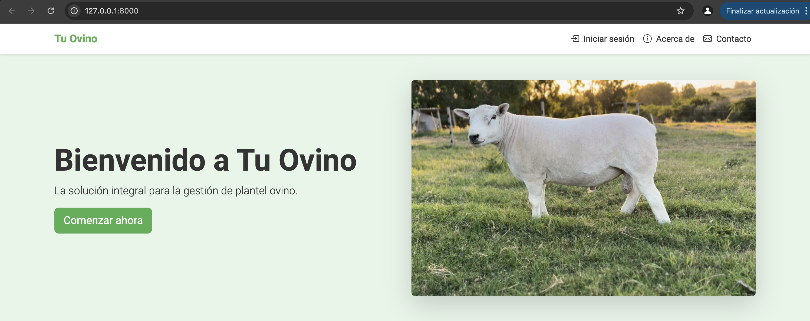
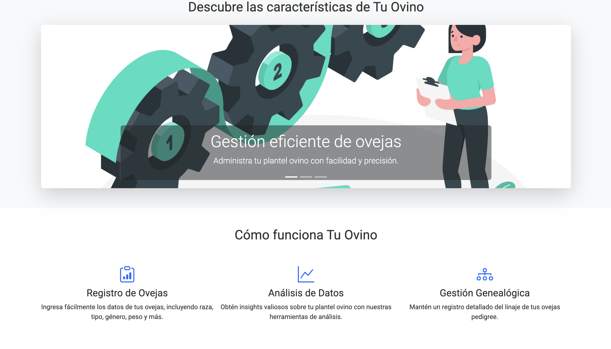
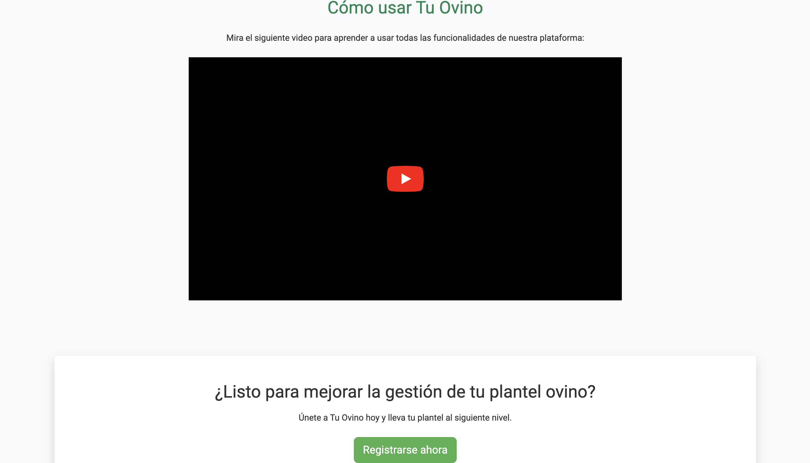

### Ovino Hub
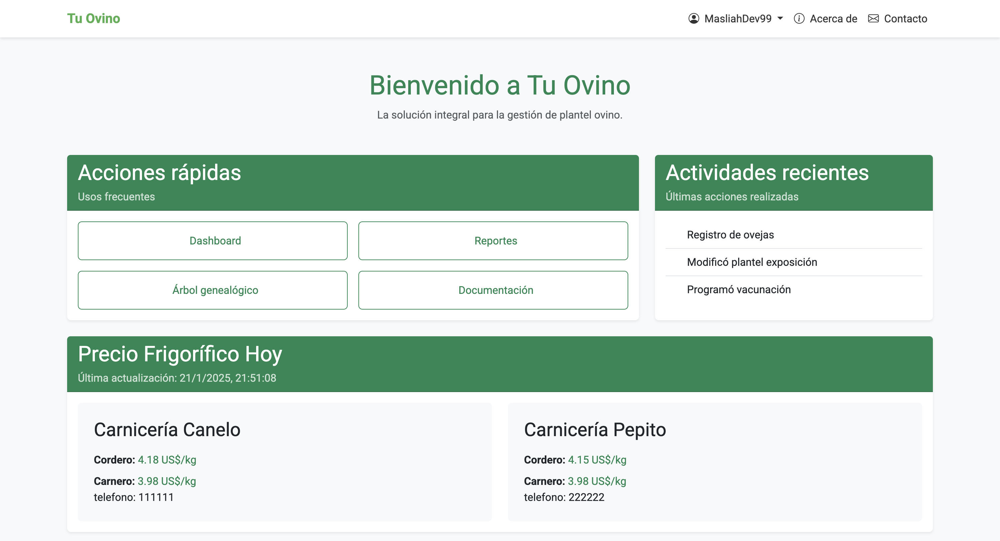
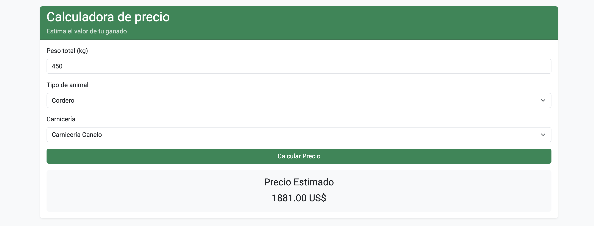

#### Dashboard
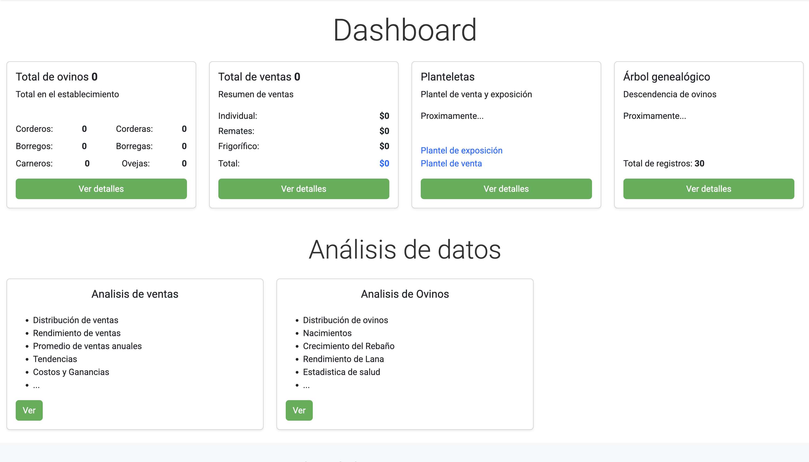

### Sheep managment
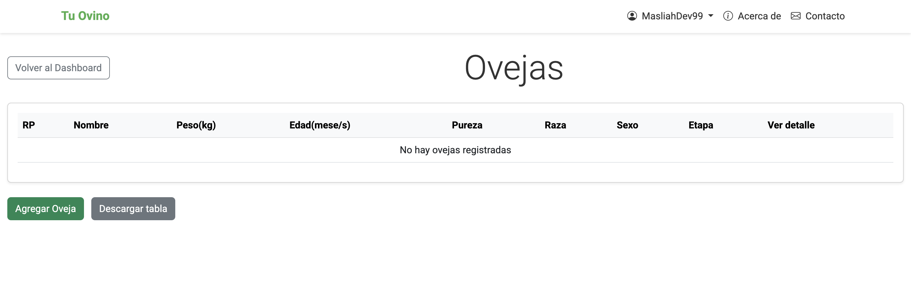
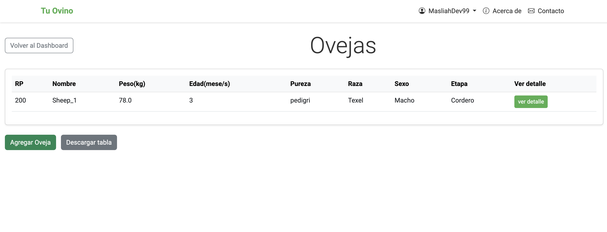
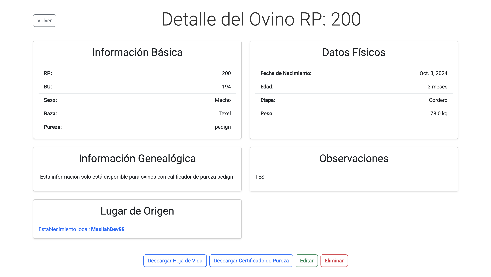

### Sales
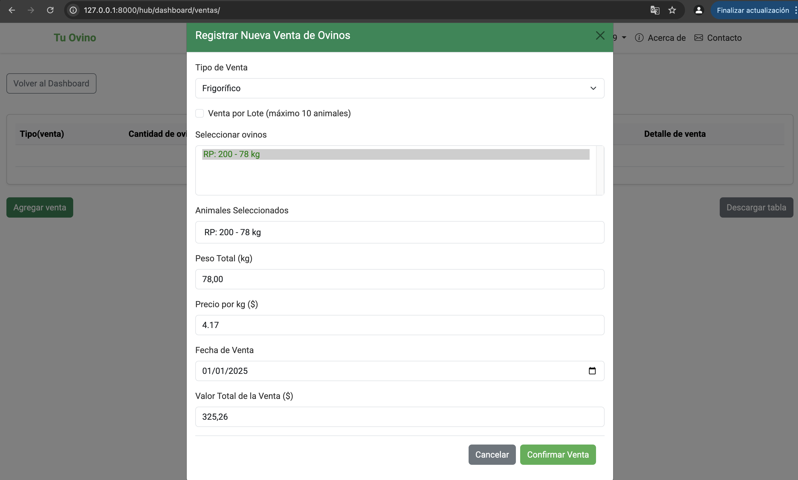
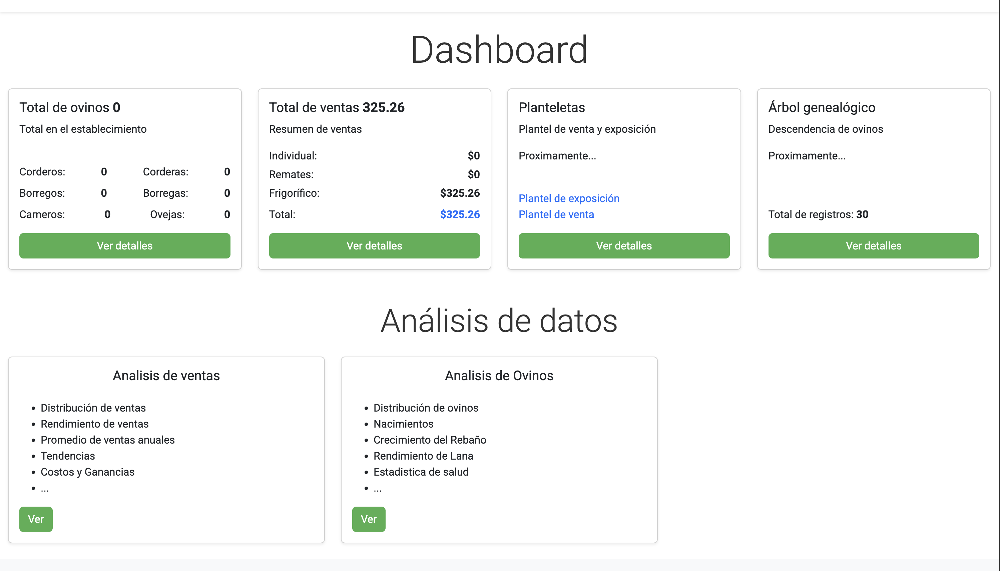
#### Statistic 


### Video Tutorial
Watch the tutorial embedded in the [homepage](http://127.0.0.1:8000) or view it directly on [YouTube](https://youtu.be/h0gDXW7UJfA).

---


## Project Requirements

### General Objectives
Develop an application capable of:  
- Managing detailed records of a sheep herd, including general data, genealogy, status, and transactions.  
- Providing valuable statistics and analysis for herd management.  
- Implementing a simple and accessible interface for users with varying levels of technical expertise.  

### Functional Requirements

1. **Sheep Management:**  
   - Record data such as breed, weight, gender, status (active, sold, deceased), and genealogy.  
   - Update the status of sheep, such as registering sales or deaths.  
   - Edit and delete existing records.  

2. **Sales Management:**  
   - Record individual, batch, or slaughterhouse sales.  
   - Register sale values and calculate transaction statistics.  

3. **Analytics and Statistics:**  
   - Display herd statistics (total number of sheep, status, predominant breeds, etc.).  
   - Generate graphs to facilitate data visualization.  

4. **Local API Consumption:**  
   - Create APIs to allow the frontend to dynamically fetch data from the backend efficiently.  

5. **Access and Authentication:**  
   - Implement a user registration and authentication system.  
   - Restrict access to certain functionalities based on user roles.  

6. **Usability:**  
   - Design a responsive, user-friendly interface.  

### Non-Functional Requirements

- **Scalability:** The system must be scalable to support a larger database in the future.  
- **Efficiency:** Minimize response times in API consumption.  
- **Security:** Protect user data using encryption and secure practices.  

---

## Use Cases

### Use Case: Register a Sheep
1. **Primary Actor:** Registered user.  
2. **Main Flow:**  
   - The user accesses the sheep registration form.  
   - Enters required data (breed, weight, gender, status, etc.).  
   - Saves the record.  
3. **Expected Outcome:** The sheep is successfully registered and appears in the list of active sheep.  

### Use Case: Register a Sale
1. **Primary Actor:** Registered user.  
2. **Main Flow:**  
   - The user selects sheep to sell.  
   - Enters sale information (type of sale, value, date).  
   - Saves the record.  
3. **Expected Outcome:** The selected sheep are marked as "sold," and the sale is successfully recorded.  

### Use Case: Generate Statistics
1. **Primary Actor:** Registered user.  
2. **Main Flow:**  
   - The user accesses the analytics section.  
   - Views dynamically generated graphs and statistics.  
3. **Expected Outcome:** The user obtains valuable insights for herd management.  

---

## Design Documentation

### Architecture Diagram

The application follows an **MVC** (Model-View-Controller) architecture:  

- **Frontend:** HTML, CSS, JavaScript, and Bootstrap.  
- **Backend:** Django + Django REST Framework to handle server logic and APIs.  
- **Database:** SQLite (for development) with plans to migrate to PostgreSQL.  

### Local APIs

- **Sheep Endpoint:**  
  - `GET /api/ovejas/`: Lists all sheep.  
 
  

- **Sales Endpoint:**  
  - `GET /api/ventas/`: Lists all recorded sales.  
 

---

## Technologies Used

- **Backend:** Django + Django REST Framework + Python.  
- **Frontend:** HTML, CSS, JavaScript, Bootstrap.  
- **Database:** SQLite (development), PostgreSQL (future).  
- **Development Tools:** VS Code, Git, and GitHub.  

---

## Installation

### Requirements
- Python 3.9+  
- Django 4.0+  
- Dependencies listed in `requirements.txt`.  

### Installation Steps:
1. Clone the repository:  
   ```bash
   git clone https://github.com/your_username/tu-ovino.git
   cd tu-ovino
2. Create a virtual enviroment:

    ```bash
    python3 -m venv  env
    source env/bin/activate  # On Windows: .\env\Scripts\activate

3. Install dependencies:
    ```bash
    pip install -r requirements.txt
  
4. Apply migrations:
   ```bash
   python3 manage.py makemigrations
   python3 manage.py migrations

5. Start server:
    ```bash
    python3 manage.py runserver

 #### Access the application at http://127.0.0.1:8000.
---

## Next steps

1.	Implement advanced analytics using language models (LLMs).
2.	Create a system for bulk sheep registration via Excel files.
3.	Add options to manage documents (vaccination records, life histories).
4.	Enhance data export features in Excel and PDF formats.
5.	Expand local API functionalities.


